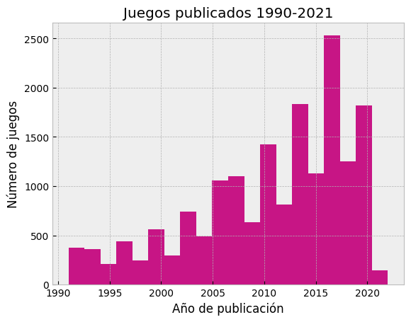
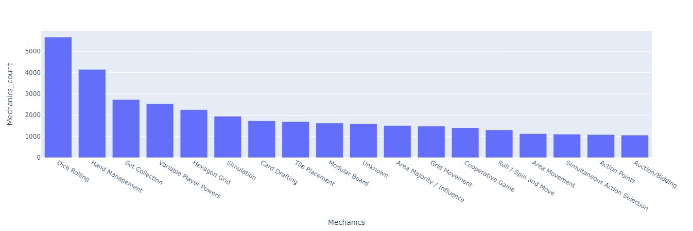
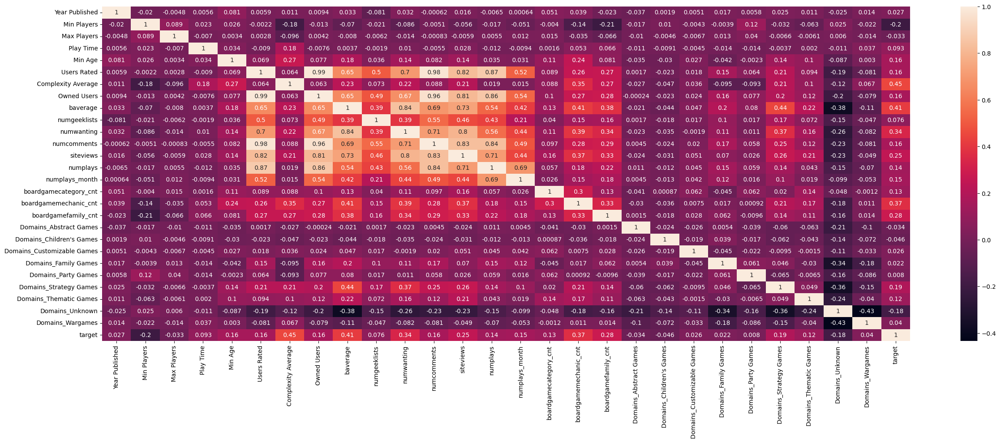
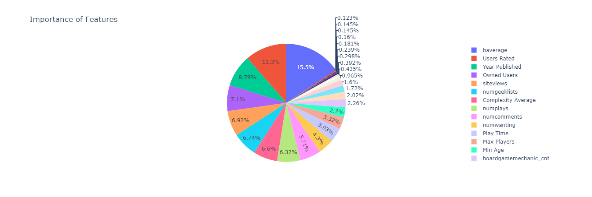

# ML BGG
## Machine Learning Project with BoardGames

### Table of Contents  
[Intro](#Intro)  
[Exploratory Data Analysis](#Exploratory-Data-Analysis)  
[Feature Engineering](#Feature-Engineering)  
[Final Thoughts](#Final-Thoughts)  
[Sources](#Sources)

### Intro
-------------
This is a Machine Learning project to analyze board games and predict the average rating of other games. The initial dataset was from Kaggle and we worked with the variables to adapt them and make them suitable for the Machine Learning models.

The objective of the project is to try to predict the average rating of boardgames if we provide the model with enough data such as the minimum age to play, the number of players or what kind of mechanics exist within the game.

### Exploratory Data Analysis
-------------
While doing the EDA, we discovered that there was a huge difference in releases in the last 30 years and the market could be over saturating.  

Most of the games are for 2 or 4 players and while generally, people prefer to keep it simple when playing(low complexity), some of the newer games try to explore new frontiers. We can also see that dices and resource management maintain their positions as the most popular type of games.  

And finally, we can take a look at the heatmap to see the correlations between the variables in the dataset.

### Feature Engineering
-------------
Getting rid of the NaN values were the utmost priority. Since there was only a few rows with more NaN than data, we just got rid of them (unknown games that lacked a lot of information). After that, we noticed that the Domains column had a lot of missings, so we assigned them the Unknown categorical to start. After that, I separated the column with dummies to help them classify it.
Before starting the ML part, we also erased some columns (ID, BGG Rank...) since there wasn't a straight connection with the prediction.

### Final Thoughts
-------------
After the initial trainings, the first models showed that the XGB Regressor, RandomForestRegressor or DecissionTreeRegressor were the ones with the highest scores. That's why we decided to explore more parameters within those regressors.  

**Initial iteration**  
| Model | R2 Score |
| ------------- |-------------:|
| [XGB Regressor](https://xgboost.readthedocs.io/en/stable/parameter.html) | 0.857179 |
| [Gradient Boosting](https://scikit-learn.org/stable/modules/generated/sklearn.ensemble.GradientBoostingRegressor.html) | 0.618233 |
| [Random Forest](https://scikit-learn.org/stable/modules/generated/sklearn.ensemble.RandomForestRegressor.html) | 0.588974 |
| [Decision Tree](https://scikit-learn.org/stable/auto_examples/tree/plot_tree_regression.html) | 0.391220 |

While training the models, the feature importances showed that the Bayesian average and interaction with the game (visits to the board game page, comments about them, adding them to their wishlists...) helped greatly when trying to predict their rating. The last iteration shows that some models improved more than others, but in the end, the ranking stays the same. Please, note that the scoring is with the train data. When trying to predict new data, the scoring lowered a little bit but stayed constant.   

**Last iteration**  
| Model | R2 Score | R2 Score with new data |
| :--- | :---: | ---:|
| [XGB Regressor](https://xgboost.readthedocs.io/en/stable/parameter.html) | 0.899273 | 0.889522 |
| [Gradient Boosting](https://scikit-learn.org/stable/modules/generated/sklearn.ensemble.GradientBoostingRegressor.html) | 0.826174 | 0.792521 |
| [Random Forest](https://scikit-learn.org/stable/modules/generated/sklearn.ensemble.RandomForestRegressor.html) | 0.800226 | 0.647375 |

And the winner was the XGB Regressor, and the feature importances were:  

### Sources
-------------
The initial dataset was from [Kaggle](https://www.kaggle.com/datasets/andrewmvd/board-games).
* Python: 3.7.4
* Python libraries such as pandas, seaborn or sklearn.